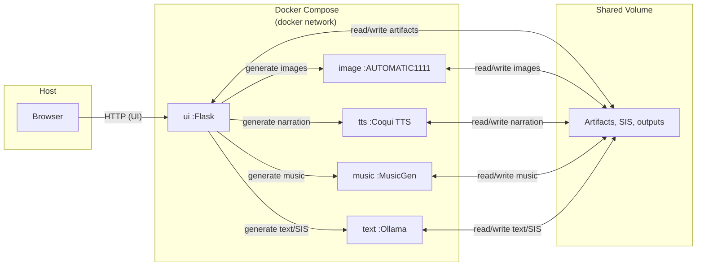

# GeNarrative

> Note: This repository is an experimental project and is still under active development and validation. Specifications and behavior may change without notice.

## 🌟 Overview
GeNarrative is an experimental multimodal generation workflow system that runs locally.
By combining scripts, illustrations, narration, and BGM, you can create an original story experience offline.

- The first run requires model downloads and container builds (from the second run onward, it typically works offline).
- It emphasizes iterating on **generate → regenerate → compare → edit** via **SIS (Semantic Interface Structure)**, a “semantic schema” that sits between assets and generation.
- Each capability is isolated in Docker containers, with a focus on privacy, reproducibility, and extensibility.

- Example inputs: scripts, children’s hand-drawn illustrations
- Example outputs: narrated multimedia stories (HTML / MP4)
- Goal: not a **finished app**, but a state where the generation pipeline can be **observed, reproduced, and compared**

## What’s new

### 1) SIS: make the “semantic schema” explicit
GeNarrative represents meaning information about works/scenes as **SIS** in JSON, enabling:

- Swap **models/parameters** while keeping meaning (SIS) fixed
- Keep generation conditions for **reproducibility**
- **Manually edit/correct** SIS even if extraction is imperfect

### 2) Local & modular: easy to swap and compare components
The UI orchestrates each service’s REST API and aggregates artifacts into `shared/`.
This makes it easier to compare modules independently (LLM / image generation / TTS / music generation).

## 🔍 Related work
Google Gemini includes a “Storybook” feature that can generate a 10-page illustrated storybook from prompts and photos/images, and can also read it aloud.

GeNarrative is designed less to reproduce the same polished experience, and more as a local experimental pipeline centered on SIS (a semantic schema) to make generation, regeneration, comparison, and component swapping easier (this project is not affiliated with Google).

## 🏗️ Architecture / Tech stack
GeNarrative uses a microservices architecture. The UI orchestrates each service’s REST API, and artifacts are passed via shared storage.



| Component | Tech | Default Port | Description |
|---|---:|---:|---|
| Integrated UI | Flask + Swiper.js | 5000 | All-in-one front/back + workflow execution |
| Image generation | AUTOMATIC1111 (Stable Diffusion) | 7860 | Illustration/image generation |
| Speech synthesis | Coqui TTS | 5002 | Narration generation |
| Music generation | AudioCraft (MusicGen) | 5003 | Background music / SFX generation |
| LLM runtime | Ollama (Gemma3) | 11434 | Text generation, SIS conversion assistance |

- Internal network: Docker bridge network
- Shared storage: `shared/` (used by all services)
- Default ports may be overridden by `docker-compose.yml`

## 🧩 SIS (Semantic Interface Structure)

- GeNarrative uses **SIS (Semantic Interface Structure)** as a common format for multimodal generation.
- SIS acts as the hub: generate SIS from scripts/images, then generate scripts/illustrations/BGM, etc. from SIS in a unified way.
- It also anticipates re-extracting SIS from generated artifacts for search and evaluation (consistency checks).
- See `docs/SIS.md` for details.

## 📁 Directory structure

```text
GeNarrative/
├── docker-compose.yml      # service definitions
├── requirements.txt        # shared Python deps
├── docs/                   # documentation
├── sd/                     # image generation (Stable Diffusion WebUI)
├── tts/                    # speech synthesis (Coqui TTS)
├── music/                  # music generation (MusicGen)
├── ui/                     # UI + Flask integration server
└── shared/                 # shared data/artifacts
```

## 🔧 Technical challenges and approaches

| Challenge | Approach |
|---|---|
| Controlling multimodal generation | Design a unified schema (SIS) + modality-specific meta-prompts |
| Heavy libraries / resource contention | Split into containers to localize load |
| Running on local GPU | Use quantized / lightweight models |
| Integrated output | HTML + Swiper.js or MP4 export |

## 🚀 Quick start (Windows / PowerShell)

Install Docker in advance (NVIDIA environment is required to use GPU).

- Estimated setup time: 30+ minutes from first install to first boot
- Required free disk space: 100GB+
- Recommended GPU: 12GB+ VRAM (depends on model configuration)
  (downloads/builds are the primary cause)

```powershell
git clone https://github.com/joyk0117/GeNarrative.git
cd GeNarrative
docker compose up -d
```

After starting, open `http://localhost:5000/` in your browser.

### Check service status

```powershell
# list all services
docker compose ps

# check logs per service
docker compose logs ui      # UI server
docker compose logs music   # music server
docker compose logs tts     # TTS server
docker compose logs sd      # image server
docker compose logs ollama  # text server
```

### Access

- Integrated UI: http://localhost:5000
- Image generation (A1111): http://localhost:7860
- LLM API (Ollama): http://localhost:11434

For exact ports, see `docker-compose.yml`.

## 🛠️ Troubleshooting (Windows)

### GPU / CUDA

- Check GPU status with `nvidia-smi` (run in WSL2 or a compatible environment)
- To use GPU in Docker, you need the equivalent of NVIDIA Container Toolkit setup

### Port conflicts

```powershell
# check port usage (example: 5000)
netstat -ano | Select-String ":5000"

# after checking PID, stop the process
Get-Process -Id <PID>
Stop-Process -Id <PID> -Force
```

### API connectivity / network

```powershell
# check container-to-container connectivity (examples)
docker compose exec ui ping -c 1 music
docker compose exec ui ping -c 1 tts

# check logs
docker compose logs ui
docker compose logs music
docker compose logs tts
```

## ✅ Reproducibility checklist

- Start all services with `docker compose up -d`
- Capture logs with `docker compose logs`
- Artifacts are saved under `shared/` (subdirectories differ by module)
- Main endpoints (defaults):
	- http://localhost:5000 (UI)
	- http://localhost:7860 (Image)
	- http://localhost:5002 (TTS)
	- http://localhost:5003 (Music)
	- http://localhost:11434 (Ollama)

## 📚 Docs / References

- Structured spec (SIS): `docs/SIS.md`
- UI/API details: `ui/README.md`, `ui/API_REFERENCE.md`
- TTS details: `tts/README.md`

## 🎯 Roadmap

- Advanced workflow management
- Stronger multilingual support
- Integration with external AI services
- SIS generation from music and speech
- Reduce installation time and disk footprint (uv, Docker optimization)
- Gradual modernization (frontend: Flask → Vue.js, backend: Flask → FastAPI)
- Fine-tuning (Image: LoRA, LLM: Unsloth)

## 🧪 Development notes

- Some parts of this repository were built using LLM-based coding assistance (AI-assisted coding).
- Architecture design (Docker separation/workflow), SIS schema design, service integration, and verification/debugging were done by the author.

## 📜 License

MIT License  
Copyright (c) 2025 Yuki Jo

Note: This repository contains orchestration code only.
Third-party models/tools/assets such as Ollama, AUTOMATIC1111, Coqui TTS, MusicGen, etc. must be obtained separately and used in accordance with their respective licenses.
