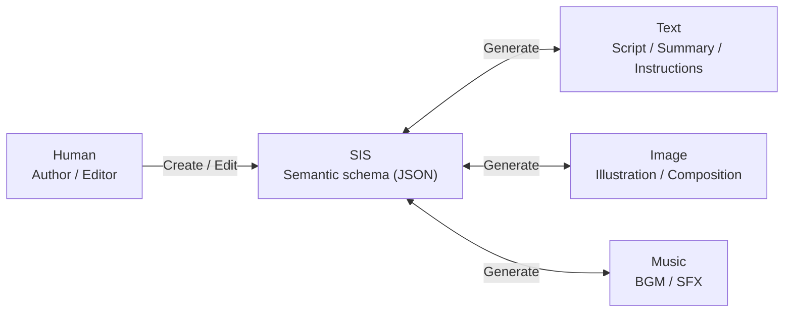

# 🧩 GeNarrative – Semantic Interface Structure (SIS) Specification

## 🎯 1. Overview

Semantic Interface Structure (SIS) is a **semantic schema that extracts “meaning information” about a work or scene and makes it the hub for generation, search, and reuse**.
It separates **what to create (meaning)** from **how to create it (models/prompts)**, and serves as a shared language across generation, search, and learning/evaluation phases.

### Key benefits

1. **Modularity & controllability**
   - Keep meaning (SIS) fixed while swapping models (SD/MusicGen, etc.) and parameters.
2. **Reproducibility & explainability**
   - Record “what meaning specification produced this output” in JSON; supports provenance and regeneration.
3. **Editable “parameters” and manual correction**
   - Even if LLM extraction is imperfect, structured data is easy to fix/augment by hand.
4. **Unified interface for search and recommendation**
   - Enables meaning-based queries like “melancholic + night + piano”.
5. **Foundation for training data and evaluation**
   - Use SIS as ground-truth for prompt generation, QA creation, and model evaluation (consistency checks).
6. **Hub for vector DB / other models**
   - Vectorize SIS elements to bridge to external DBs and embedding models.

### SIS-centered relationship diagram (concept)



---

## 🏗 2. Layer structure (Story / Scene / Media)

Within GeNarrative’s scope, SIS is composed of three object types.

### StorySIS (top layer: the whole work)

- Holds the semantic structure for the whole work.
- Story structure type (kishotenketsu, three-act, etc.)
- Global theme and character settings
- Global style policies (writing style, visual style, music direction)

### SceneSIS (middle layer: unit of meaning)

- Represents the **smallest semantic unit (one scene)**.
- Scene meaning (summary / semantics)
- Scene-level generation policies (text / visual / audio)
  - For reusability, SceneSIS does **not** include `story_id` (so the same Scene can be reused across multiple Stories).

### MediaSIS (bottom layer: unit of expression) — under consideration / currently unused

- Represents **scene components (expression units)** by further decomposing a SceneSIS.
- Examples: shots (composition), dialog, narration, subtitles, sound effects, BGM segments, props/objects, etc.

#### Connections between layers and external indexing

- The linkage between StorySIS / SceneSIS / MediaSIS (mapping of `story_id`, `scene_id`, `media_id`) is not stored directly inside each SIS JSON; it is managed as an external index.
- This allows a single SceneSIS / MediaSIS to be reused from multiple StorySIS (reusability), and enables swapping relationships without changing the Story/Scene/Media objects themselves.
- Concretely, this could be stored as a graph structure (graph DB) or relational mapping tables.

---

## 📘 3. StorySIS specification

### 3.1 StorySIS – JSON schema (concept)

```jsonc
{
  "sis_type": "story",
  "story_id": "123e4567-e89b-12d3-a456-426614174000",

  "title": "The Girl and the Sun",
  "summary": "A girl befriends the sun and learns to share its light.",

  // Global semantic structure (theme/style policy)
  "semantics": {
    // Shared semantic info for the whole work
    "common": {
      "themes": ["trust", "learning"],
    },
    // Optional global style policies
    "text":  {"language": "English", "tone": "gentle", "point_of_view": "third"},
    "visual": {"style": "watercolor"},
    "audio": {"genre": "ambient"}
  },

  "story_type": "three_act", // e.g. "kishotenketsu" | "three_act" | "attempts" | "circular" | "catalog"

  // Story scene blueprints
  "scene_blueprints": [
    {
      "scene_type": "setup",
      "descriptions": [
        "Introduce the protagonist and the setting (a sunny town / hill) and place a longing for the 'Sun' within daily life.",
        "Depict the comfort and joy brought by sunlight, while also hinting at small anxieties about 'shadows' or 'clouds'."
      ]
    },
    {
      "scene_type": "setup",
      "descriptions": [
        "The protagonist talks to the sun and chases the light, and a budding relationship begins.",
        "Plant foreshadowing for a later conflict: an important promise (not to monopolize the light) and a small device (mirror/hat, etc.)."
      ]
    },
    {
      "scene_type": "conflict",
      "descriptions": [
        "Clouds spread and the sun is hidden. The protagonist panics and tries to bring the light back, but it backfires.",
        "The desire for light clashes with consideration for others, creating misunderstanding and regret."
      ]
    },
    {
      "scene_type": "resolution",
      "descriptions": [
        "The protagonist understands the sun is something that returns, and that light can be shared.",
        "Small actions (staying close to a friend / finding a place with shade, etc.) soften the atmosphere, and light shines through the clouds."
      ]
    },
    {
      "scene_type": "resolution",
      "descriptions": [
        "As an epilogue, show the same daily life looking slightly different (accepting both light and shadow).",
        "Put the learning into words (sharing/trust) and close with a gentle, settled relationship with the sun."
      ]
    }
  ],
}
```

### 3.2 Field details (excerpt)

| Field | Type | Description |
|---|---|---|
| `story_type` | string | Type of story structure (e.g., kishotenketsu) |
| `semantics.common.themes` | array | Global themes |
| `semantics.common.descriptions` | array | Supplemental descriptions not fully captured by `summary` (nuance/intent, etc.) |
| `semantics.text` / `semantics.visual` / `semantics.audio` | object | Global style policy (can be overridden by SceneSIS/MediaSIS) |

### 3.3 Standard `story_type` values

Typical patterns and the mapping to `scene_blueprints[].scene_type`:

| `story_type` | Summary | `scene_type` (in `scene_blueprints[]`) |
|---|---|---|
| `three_act` | Drama (challenge → resolution) | `setup` (1–2 scenes) / `conflict` (1–5 scenes) / `resolution` (1–2 scenes) |
| `kishotenketsu` | Twist/turn (meaning flips at the end) | `ki` (1) / `sho` (1–2) / `ten` (1) / `ketsu` (1–2) |
| `attempts` | Multiple attempts (trial and error) | `problem` (1) / `attempt` (repeat) (2–5) / `result` (1) |
| `catalog` | Catalog/encyclopedic (weak ordering) | `intro` (1) / `entry` (repeat) (3–10) / `outro` (1) |

---

## 🎬 4. SceneSIS specification

SceneSIS is a JSON object that describes one scene.
Both **JSON** and **JSONL** are supported for storage, but **JSONL (one Scene per line)** is recommended when handling many scenes.

The schema example below is **JSONC (JSON with comments)** for explanation. Real files should be plain JSON/JSONL without comments.

### 4.1 SceneSIS – JSON schema (concept)

```jsonc
{
  "sis_type": "scene",
  "scene_id": "123e4567-e89b-12d3-a456-426614174000",

  "summary": "Introduction of the girl and the forest.",

  // Scene meaning + generation policy (multimodal shared background)
  "semantics": {
    "common": {
      "mood": "calm",
      "characters": [
        {
          "name": "Nancy",
          "traits": ["girl", "curious"],
          "visual": {
            "hair": "brown curly hair",
            "clothes": "striped shirt and purple skirt"
          }
        }
      ],
      "location": "forest",
      "time": "day",
      "weather": "sunny",
      // Salient motifs and colors (easy to semantically label)
      "objects": [
        { "name": "big_sun", "colors": ["yellow", "orange"] },
        { "name": "small_house", "colors": ["red", "brown"] },
        { "name": "tree", "colors": ["green", "brown"] }
      ],
      "descriptions": [
        "Nancy quietly observes the forest, feeling both curiosity and a slight nervousness.",
        "The scene emphasizes gentle light and a peaceful, exploratory mood."
      ]
    },

    // Modality-specific semantic info
    "text": { "style": "simple", "language": "English", "tone": "gentle", "point_of_view": "third" },
    "visual": { "style": "watercolor", "composition": "mid-shot", "lighting": "soft", "perspective": "eye-level" },
    "audio": { "genre": "ambient", "tempo": "slow", "instruments": ["piano", "pad"] }
  },
}
```

> Note: Scene role labels (e.g., ki/sho/ten/ketsu or setup/conflict/resolution) are not stored in SceneSIS. Manage them via `scene_blueprints[].scene_type` in StorySIS or via an external index.

### 4.2 Field details (excerpt)

#### 4.2.1 `semantics` (scene meaning)
A “semantic background” referenced by image/text/audio. `semantics.common` may include:

| Field | Description |
|---|---|
| `characters` | Character details in the scene (ID/name/appearance, etc.); can include scene-specific clothing |
| `location` | Place |
| `time` | Time of day |
| `weather` | Weather |
| `mood` | Mood/atmosphere |
| `objects` | Important objects/motifs and their colors |
| `descriptions` | Notes/intent/nuance not captured by `summary` (multiple allowed) |

#### 4.2.2 `semantics.text` / `semantics.visual` / `semantics.audio` (scene-level policy)
- These fields define **scene-level defaults**.

---

## 🧩 5. MediaSIS specification

MediaSIS decomposes a SceneSIS into “components” (expression units).
By aligning generation/editing/output to MediaSIS as the smallest unit, both coarse-grained scenes and fine-grained scenes can be handled within the same framework.

### 5.1 MediaSIS – JSON schema (concept)

Below is a sample MediaSIS extracted from **visual** content, and does not include text or audio elements.

```jsonc
{
  "sis_type": "media",
  "media_id": "aaaaaaaa-bbbb-cccc-dddd-eeeeeeeeeeee",

  // Short summary of this component
  "summary": "a happy scene in a park with a big sun and a small house",

  // Which modality this Media element targets (visual in this example)
  "media_type": "visual",

  // Semantic structure (extraction target)
  "semantics": {
    "common": {
      "mood": "happy",
      "descriptions": [
        "The drawing conveys a strong sense of safety and warmth between the two figures.",
        "Colors are intentionally vivid to reflect a child's joyful perception of the world."
      ],

      "location": "park",
      "time": "day",
      "weather": "sunny",

      "characters": [
        {
          "name": "girl",
          "traits": ["small", "smiling"],
          "visual": {
            "hair": "brown curly hair",
            "clothes": "striped shirt and purple skirt"
          }
        }
      ],

      "objects": [
        { "name": "big_sun", "colors": ["yellow", "orange"] },
        { "name": "small_house", "colors": ["red", "brown"] },
        { "name": "tree", "colors": ["green", "brown"] }
      ]
    }
  },

  // Provenance / generation record
  "provenance": {
    "assets": [
      {
        "asset_id": "child_drawing_001",
        "uri": "shared/.../child_drawing_001.png"
      }
    ],
    "generator": {
      "system": "ollama",
      "model": "...",
    }
  }
}
```

#### 5.2 `semantics.text` / `semantics.visual` / `semantics.audio` (media-level policy)
- These fields define **MediaSIS-level policies**, inheriting from SceneSIS and overriding as needed.
- Typical fields per modality:

| Modality | Example fields |
|---|---|
| text | `style`, `language`, `tone`, `point_of_view`, etc. |
| visual | `style`, `composition`, `lighting`, `perspective`, etc. |
| audio | `genre`, `tempo`, `instruments`, `mood`, etc. |

## 🚀 6. Use cases

### A. Typical use cases in GeNarrative
- **Child’s drawing → SIS extraction:** extract meaning from an image into SIS, then generate story/BGM from it.

### B. Cataloging existing content
- Automatically extract SIS from commercial picture books or public-domain literature and use it for meaning labeling such as “picture book recommendations” or “find BGM that fits this scene”.

### C. Education / research
- Run controlled comparisons such as “change only the images” or “change only the BGM” under the same SIS to study impacts on learning outcomes.

### D. Connecting to evaluation protocols
- Treat SIS as “ground-truth meaning structure” and quantify how well generated content matches SIS for model evaluation.

----

## 🧪 7. Recommended generation workflow

1. Generate SceneSIS
   - Extract SceneSIS from existing materials (images/text)
2. Generate the scene
   - Generate modalities other than the extraction source (images/text/speech/music) to produce a single scene
   - Use meta-prompts as needed to generate modality-specific prompts
3. Generate StorySIS
   - Choose `story_type` and generate StorySIS including `scene_blueprints`
   - In SIS UI or `/api/sis2sis/scene2story`, you can input `story_type` (three-act / kishotenketsu / attempts / catalog / circular) to **fix the structure without relying on the LLM** (leave blank to infer)
   - If you also specify `scene_type` (setup / ki / intro, etc.) for each SceneSIS via the UI dropdown or `scene_type_overrides`, the generated `scene_blueprints[]` will reliably carry those labels
4. Generate the remaining SceneSIS
   - Generate the remaining SceneSIS from `scene_blueprints`
5. Generate the remaining scenes
   - Generate the remaining scenes from the remaining SceneSIS

----

## 🔗 8. Inspirations / related concepts

SIS is a custom specification, but shares design ideas with the following concepts.
These are **references/analogies** only; SIS does not claim compliance or compatibility.

### OpenUSD (separating scene description ↔ rendering)

OpenUSD separates “scene description as an editable object” from “output (rendering)”, making swapping, composition, and reuse easier.
SIS extends a similar idea beyond 3D into multimodal creation (stories/images/audio), treating “meaning” as an editable semantic schema.

### W3C PROV (provenance model)

SIS’s `provenance` is intended to store “which inputs and generation conditions produced this”.
This aligns conceptually with W3C PROV (Entity / Activity / Agent) as a reference for future extensions/interoperability.

### JSON Schema (validation for editable JSON)

Because SIS is intended to be edited by humans, schema-based validation (required fields, types, enums, etc.) can reduce corruption and inconsistency.
JSON Schema is a useful foundation for schema evolution (backward compatibility) and tool integration (form UI generation).

## 🧭 9. Comparison with alternative approaches (reference)

SIS is positioned as a “semantic schema” to connect modalities, but similar goals can be achieved by other designs.
This section summarizes common alternatives and how they differ.

---

### 9.1 Overview of approaches

#### A) SIS (explicit schema JSON)
- **Summary**: Keep meaning as an explicit schema (JSON) that connects image/text/music generation and can be edited by humans.
- **Best for**: iterative improvement (generate → fix → regenerate), diff management, verification, model swapping, explainability.
- **Weakness**: schema design, transformations (SIS → modality conditions), and operational cost can be significant; may be overkill for “quick and dirty” output.

#### B) Direct piping (no intermediate)
- **Summary**: Generate captions/instructions from images/text and feed directly into each modality generator; meaning is not fixed as a schema.
- **Best for**: quickest prototypes, demos, one-shot personal use.
- **Weakness**: poor reproducibility/diffing/verification; hard to reliably adjust only specific attributes; behavior changes with model changes.

#### C) Natural-language script / story bible
- **Summary**: Use structured prose documents (world, characters, scene outlines, mood) as intermediate artifacts instead of JSON.
- **Best for**: human readability and iterative creative editing while keeping flexibility.
- **Weakness**: difficult to validate mechanically (types/constraints) and to interpret diffs semantically; search/reuse needs extra work.

#### D) Embeddings / latent intermediate (vector)
- **Summary**: Convert assets into embedding vectors and use similarity search or conditioning; the “meaning schema” is a vector.
- **Best for**: large-scale asset search/recommendation and similarity-based reuse.
- **Weakness**: hard for humans to edit; tends toward a black box; difficult to “change only this attribute”; verification is hard.

#### E) Graph (knowledge graph / scene graph)
- **Summary**: Represent meaning as nodes/edges (e.g., “Character A holds object B”, “location is forest”).
- **Best for**: relational consistency checks, dependency management, constraints/inference.
- **Weakness**: high design/implementation cost; maintaining creative freedom can be challenging.

#### F) Existing standards + extensions (e.g., OpenUSD)
- **Summary**: Align with existing standards (especially scene/asset management) and store required meaning as extended metadata.
- **Best for**: integrating into existing production/asset pipelines and leveraging standard ecosystems.
- **Weakness**: high adoption/operational cost; narrative/emotional meaning often still needs a separate layer.

---

### 9.2 Balance comparison table (✓ / △ / ✗)

- **✓**: strong / straightforward
- **△**: depends / needs extra design
- **✗**: weak / typically requires additional mechanisms

| Approach | Fast start (quick results) | Human-editable | Reproducibility / diff mgmt | Validation via types/constraints | Robust to model swapping | Less black-box | Search / reuse | Implementation/ops cost | Creative freedom |
|---|---|---|---|---|---|---|---|---|---|
| **SIS (explicit schema JSON)** | △ | ✓ | ✓ | ✓ | ✓ | ✓ | ✓ | △ | △ |
| Direct piping (no intermediate) | ✓ | ✗ | ✗ | ✗ | △ | ✗ | △ | ✓ | ✓ |
| Natural-language story bible | ✓ | ✓ | △ | ✗ | △ | ✓ | △ | ✓ | ✓ |
| Embeddings / latent (vector) | △ | ✗ | ✓ | ✗ | ✗ | ✗ | ✓ | △ | △ |
| Graph (knowledge/scene graph) | ✗ | △ | ✓ | ✓ | ✓ | ✓ | ✓ | ✗ | ✗ |
| Existing standards + extensions (OpenUSD, etc.) | ✗ | △ | ✓ | ✓ | ✓ | ✓ | ✓ | ✗ | △ |

---

### 9.3 Operational guideline: hybrid of SIS + natural-language `description` (recommended)

In practice, **SIS (skeleton) + descriptions (flesh)** is often easiest.

#### Basic policy
- Keep SIS to the **minimum elements you want to edit/fix** (necessary and sufficient; keep it small)
- Put flexible details into `description` (fine details, nuance, examples, candidate lists)
- During generation, prioritize “confirmed SIS fields” and use descriptions as supporting info

#### Rule of thumb: what goes into SIS
- **Put into SIS (fix/validate)**
  - Story/scene structures (things you want to validate as a type)
  - Parameters that strongly affect output: characters/setting/time/POV/tone, etc.
  - Prohibitions/constraints (e.g., no violence, for children, banned vocabulary)
  - References that affect consistency (scene_id references, parent/child relations, mappings)
- **Put into description (keep flexible)**
  - Examples, associations, phrasing candidates, additional mood notes
  - Elements you want to keep open (“like…”, “maybe…”) 
  - Model/prompt-dependent details (poetic expressions, metaphors, long scenic descriptions)
  - Multiple alternatives (bulleted candidates, etc.)

#### “Minimal SIS first” mindset (example)

- StorySIS: `genre / audience / tone / structure / theme / constraints / scenes[]`
- SceneSIS: `scene_id / summary / characters / setting / mood / key_events / constraints`
- MediaSIS: `asset_id / type / purpose / style / constraints / source_refs`

Everything else can start in `description` and be promoted into SIS fields when needed.

## 🎉 10. Summary

This specification supports:

- Story structures such as kishotenketsu (StorySIS)
- Consistent management of scene meaning + generation policy (SceneSIS)
- Decomposition into expression units via Media (MediaSIS)
- Optimization for multimodal generation
- Usability across UI / LLM / file storage
